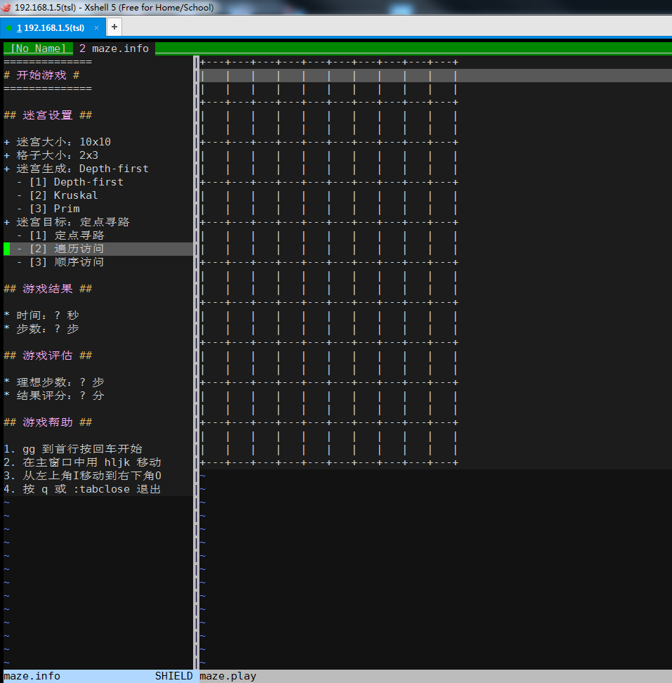
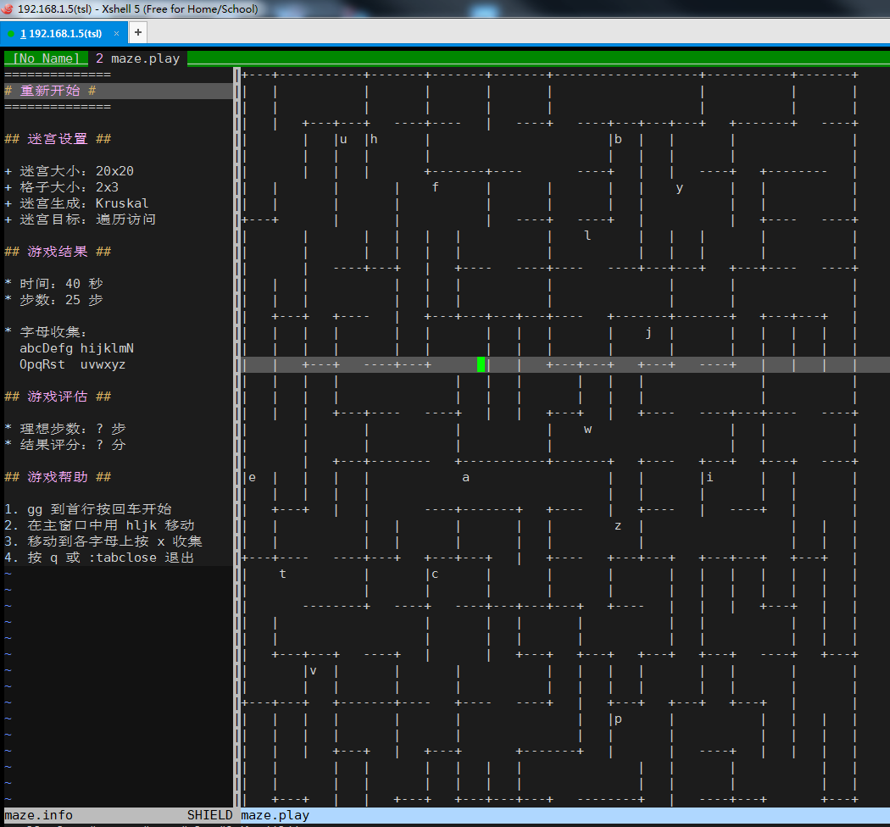

# vim 字符终端里的迷宫小游戏

* vim 版本要求，最低 7.4 ，建议 8.0
* 要求安装 [vimloo](https://github.com/lymslive/vimloo)
* 在已启用 `autoplug` 时用以下命令加载插件功能：
```vim
: PI gamemaze
: GameMaze
```
## 使用简介

* 启用命令 `:GameMaze` 将在新标签页上打开
* 支持简单设置迷宫大小、生成算法及游戏目标定义
* 主要用 `jkhl` 移动当前位置，移动到某些字母上面后可用 `x` 键删除
* 侧边小窗有简要说明信息（按 mardown 文件类型着色）
* 截图参考：


